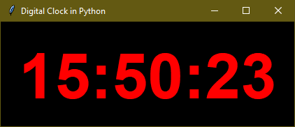

# 
 Python-based-Timer-

## An python based Timer and Digital Clock

### How to contribute to this repo❓

- Step 1: Fork the this repository
- Step 2: Clone your fork
    > git clone https://github.com/Bauddhik-Geeks/Python-based-Timer-.git
- Step 3: Change the local directory
    > cd Python-based-Timer-
- Step 4: Make branch
    > git branch \<branch name>
- Step 5: Switch branch to created branch
    > git checkout -b \<branch name>
- Step 6: Make change in local directory
- Step 7: Add changes you maked
    > git add .
- Step 8: Commit the changes
    > git commit -m "Commit message" 
      Eg git commit -m "Typo mistake fix"
- Step 9: push the changes
    > git push origin BRANCH_NAME
- Step 9: Make PR
    
